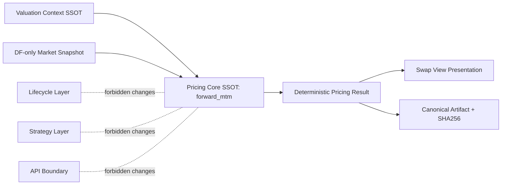

# Gate F8 Tier 2 Closure Note

Date: 2026-03-02  
Status: **Certified (Tier 2 Complete)**

## 1) Executive Summary

This document certifies the completion of **PortfolioEngine V2 / Gate F8 Tier 2**.
Tier 2 closes the deterministic valuation hardening layer required before Gate 9 Risk.

Tier 2 certifies that:
- valuation outputs are deterministic by construction,
- reporting and artifact contracts are explicit and frozen,
- aggregation and artifact hashing are invariant to ordering,
- forward/swap consistency holds under deterministic decomposition constraints.

No lifecycle coupling, strategy coupling, API boundary reshaping, or pricing-core refactoring was introduced in this tier.

## 2) Scope Included

### B2 / B2.1 — Reporting Contract
- Reporting fields are explicit at result boundaries.
- Reporting currency and metric class are carried explicitly.
- Wrapper strictness enforces context consistency.

### B3 / B3.1 / B3.2 — Swap Cashflow View (Presentation Only)
- Deterministic swap cashflow view model introduced at presentation layer.
- SSOT enforcement hardened: context-authoritative currency semantics.
- Notional and settlement-date constraints hardened in view-level representation.

### I2 — Notional Positivity in Core Forward Contract
- Forward contract notional policy locked to strictly positive magnitude.
- Direction encodes economic sign; notional does not encode sign.

### R1 — External Golden Dataset
- Deterministic external forward cases with frozen expected PV values.
- Canonical SHA256 checks for dataset artifacts.

### R2 — Extreme Stress Pack (I1–I8)
- Deterministic invariant matrix over valid extreme conditions.
- Includes positivity, linearity, antisymmetry, robustness, and permutation checks.

### R3 — Canonical Valuation Artifact
- Canonical artifact structure and SHA256 policy validated.
- Determinism and completeness checks under stable serialization rules.

### R4 — Cross-Engine Consistency
- Forward PV equivalence to swap decomposition proved for deterministic cases.
- Swap total equals deterministic near+far leg composition under fixed assumptions.

### R5 — Determinism Hardening Pack
- Artifact SHA invariance to dict/key ordering proved.
- Portfolio aggregation ΣPV permutation invariance proved.
- Manifest hash permutation invariance proved under frozen policy.
- Parallel execution consistency remains optional and was intentionally skipped in CI-oriented certification due to scheduler variability risk.

## 3) Architectural Constitution

### Determinism by Construction
Tier 2 is governed by strict deterministic principles:
- no wall-clock dependence,
- no randomness,
- no hidden defaults,
- no inference-based fallback behavior,
- explicit, reproducible inputs for valuation context, contract, and market snapshot.

### SSOT Table

| SSOT Element | Role | Tier 2 Contract |
|---|---|---|
| `valuation_context` | Valuation authority | `as_of_ts` is tz-aware; `domestic_currency` is explicit; strict mode enforces consistency |
| Reporting currency contract | Output reporting anchor | Reporting currency must equal `ValuationContext.domestic_currency` in strict contexts |
| DF snapshot (`df_domestic`, `df_foreign`) | Market input basis | Discount factors are explicit and strictly positive; no implied rates |
| `forward_mtm` | Pricing SSOT for forwards | Forward close-out PV remains the core deterministic valuation authority |
| `kernels` seam | Computational seam boundary | Boundary preserved; no Tier 2 behavioral changes |
| `swap_view` semantics | Presentation projection only | View-level determinism and SSOT alignment without pricing-kernel mutation |

### Strict Layer Separation Diagram

## 4) Contracts & Policies (Frozen)

### Reporting Currency Policy
- Reporting currency is fixed by `ValuationContext.domestic_currency` under strict operation.
- No implicit fallback policy is permitted for certified Tier 2 behavior.

### Notional Policy
- Notional is magnitude-only and strictly positive.
- Economic direction/sign is represented by contract direction fields, not by negative notional.

### DF Policy
- DF-only snapshots are the input contract.
- `df_domestic > 0` and `df_foreign > 0` are mandatory.
- No curve construction, interpolation, bootstrapping, zero-rate conversion, or compounding/day-count derivation is introduced by Tier 2.

## 5) Proven Invariants (Tier 2 Checklist)

| Invariant Category | Proven In | What Is Proven |
|---|---|---|
| Reporting contract explicitness | B2/B2.1 | Reporting fields are explicit and context-consistent |
| Swap view SSOT alignment | B3/B3.1/B3.2 | Presentation output respects context authority and deterministic view constraints |
| Notional positivity | I2 | Forward notional is strictly positive by contract |
| External reconciliation determinism | R1 | Frozen expected PV + canonical hash verification |
| Stress invariants I1–I8 | R2 | Positivity, linearity, antisymmetry, robustness, aggregation and permutation stability |
| Canonical artifact determinism | R3 | Stable schema and canonical SHA256 reproducibility |
| Cross-engine decomposition consistency | R4 | Forward/swap decomposition consistency under deterministic construction |
| Execution-condition determinism | R5 | Hash/order/aggregation invariance, manifest policy stability |

## 6) Out of Scope / Limitations

Tier 2 explicitly does **not** include:
- curves, bootstrapping, interpolation,
- zero-rate transformations,
- compounding/day-count modeling expansion,
- Greeks and risk scenario engine integration,
- lifecycle coupling,
- strategy-layer behavior,
- API boundary redesign.

Tier 2 is a deterministic valuation-contract hardening phase, not a full risk analytics expansion.

## 7) Evidence Expectations

Tier certification is valid only under slice discipline:
- one scoped slice per branch,
- one commit per slice,
- deterministic test evidence,
- required evidence block for each slice:
  - `git rev-parse HEAD`
  - `git status --porcelain`
  - `git diff --name-only origin/main...HEAD`
  - `ruff check .`
  - `pytest -q`
  - `git show --stat`

Any violation of scope or deterministic guarantees invalidates certification for that slice until corrected.

## 8) Next Gates

Gate 9 Risk should start only after these two freeze actions are completed:
1. **Boundary Guards Freeze** — formalized guardrails preventing unintended cross-layer drift.
2. **Artifact Contract Freeze** — finalized and locked artifact schema/hash contract for downstream risk/reporting consumers.

With these freezes in place, Tier 2 closure is sufficient to transition into Gate 9 risk-focused development with deterministic valuation foundations.
